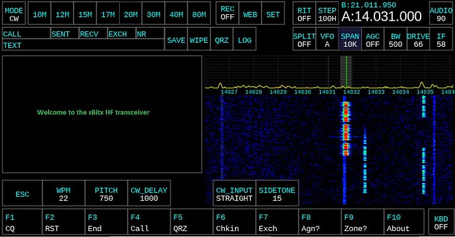

An improved version of the sBitx application designed for the sBitx hardware. Credit goes to the developers at HF Signals and A. Farhan for writing the initial code. 

Honorable mentions to Jon B. for inspiration and collaboration. This version was recompiled and modified by J. Kujawa.

The files here are to designed to replace the sBitx application and work on the default, 32 bit (stock) sBitx as shipped and the modified, 64 bit version provided in the *Releases* section.

This version now includes push button functionality of the volume and VFO buttons to cycle modes and bands. I also added selectable RX filter range buttons.

The stand-alone version of sBitx toolbox for 64 bit is available [HERE](https://github.com/drexjj/sBITX-toolbox64)

The stand-alone version of sBitx toolbox for 32 bit (original version from HF Signals) is available [HERE](https://github.com/drexjj/sBITX-toolbox)


****Backup Your Data First!****
-----
It is important to backup your existing sbitx/data and sbitx/web folders to a safe place before installing this version. A good data backup strategy is important so you do not lose your logbook, hardware calibration, and user settings.

There are two methods that you can use to perform a backup. I wrote a handy, backup utility for the original and modified versions of sBitx software. It can be installed from sBitx Toolbox and is called sBITX EZ Data. This will copy your critical, data files to a USB drive. Check it out from the links above. Or you can continue below and copy the contents to a USB drive manually.

You can make a copy of your original sbitx folder in entirety by using this set of commands from terminal
```console
cd $HOME && mv sbitx sbitx_orig
```
You can restore the sbitx/data and sbitx/web folders from your backup to the newly installed sbitx folder using these commands from terminal
```console
cd $HOME && cp -r sbitx_orig/web/* sbitx/web/ && cp -r sbitx_orig/data/* sbitx/data/
```

sBitx App First Installation
-----

Open terminal and type (or copy and paste this):

```console
cd $HOME && git clone https://github.com/drexjj/sbitx.git && cd sbitx && ./update
```

sBitx App Upgrade
-----

Open terminal and type (or copy and paste this):

```console
cd $HOME && cd sbitx && ./update
```


****Download The 64 Bit Image****
-----
A preconfigured, downloadable Raspberry Pi 4 image file is available as a beta release. This Pi image is designed to fit a 32GB SD card or USB drive and installed with Balena Etcher.

As a bonus, sBITX Toolbox is preinstalled on the image as well as other useful tools for ham radio use.

A new production version is available [HERE](https://github.com/drexjj/sbitx/releases)


****Download The 32 Bit Image****
-----
A 32 bit image will be available in the future. It is highly advised to NOT use 32 bit because support for the operating system no longer provides security patches or feature enhancements as of June 2024.

The 32 bit version will be provided for experimental use or to reload back to the stock configuration.


Become A Supporter
-----
If you find these enhancements valuable or have benefited from using it, consider supporting us. Every donation, big or small, helps us keep the lights on and the code flowing.

🌟 [Donate](https://www.paypal.com/donate/?hosted_button_id=SWPB76LVNUHEY) 🌟


Not in a position to donate? No worries! Contributing code, documentation, or simply spreading the word about this effort also goes a long way.

Thank you for your support and belief in my project!

