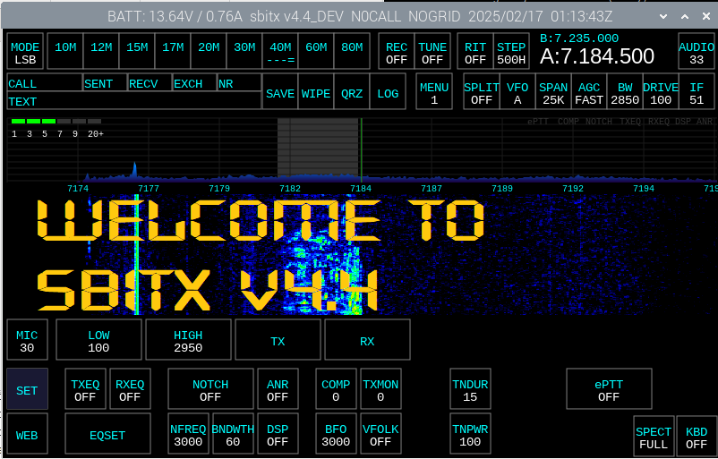

# sBitx - 64-Bit Version



An improved version of the sBitx application designed for the sBitx hardware. This version is only for the 64-bit Raspberry Pi image, which can be downloaded [here](https://github.com/drexjj/sbitx/releases).

## 🚀 Development Team

We have an incredible development team collaborating on improvements for the sBitx platform:

- **JJ - W9JES**
- **Jon - W2JON**
- **Alan - N1QM**
- **Lars - OZ7BX**
- **Lee - W4WHL**
- **Mike - KB2ML**
- **Jeff - KF7YDU**

A huge thank you to everyone who contributes their time and expertise to this project!

## 📂 File Compatibility

The files here are designed to work on the modified, 64-bit version provided in the [Releases](https://github.com/drexjj/sbitx/releases) section.

- **sBitx Toolbox for 64-bit**: [Available Here](https://github.com/drexjj/sBITX-toolbox64)
- **sBitx Toolbox for 32-bit (Factory HF Signals Version)**: [Available Here](https://github.com/drexjj/sBITX-toolbox)

## 🔴 Backup Your Data First!

Before installing this version, **backup your existing** `sbitx/data` **and** `sbitx/web` **folders** to a safe location. This ensures you don’t lose important data such as your logbook, hardware calibration, and user settings.

### Backup Methods

#### 1️⃣ sBITX EZ Data (Recommended)

A built-in backup utility for both the factory and 64-bit versions of sBitx. This tool copies your critical data files to a USB drive. It can be installed from the sBitx Toolbox.

#### 2️⃣ Manual Backup

Alternatively, you can manually back up your data using the terminal:

```console
cd $HOME && mv sbitx sbitx_orig
```

To restore your backup after installation:

```console
cd $HOME && cp -r sbitx_orig/web/* sbitx/web/ && cp -r sbitx_orig/data/* sbitx/data/
```

## 🔧 Installation & Upgrades

For detailed installation and upgrade instructions, please visit the [Wiki Page](https://github.com/drexjj/sbitx/wiki/How-to-install-or-upgrade-your-sBitx-application).

## 📥 Download the 64-Bit Image

A preconfigured, downloadable Raspberry Pi 4 image file is available. This image is designed for a **32GB SD card or USB drive** and can be installed using **Balena Etcher** or **Raspberry Pi Imager**.

**Bonus**: The image comes preinstalled with sBITX Toolbox and other useful ham radio tools.

🔗 [**Download the latest version**](https://github.com/drexjj/sbitx/releases)

## 👏 Contributors & Credits

A huge thank you to the contributors who have played a vital role in this project!

### Special Thanks To:

- **Jon - W2JON**
- **Alan - N1QM**
- **Lee - W4WHL**
- **Lars - OZ7BX**
- **Jeff - KF7DYU**
- **Mike - KB2ML**
- **Chris - W0ANM**
- **Gyula - HA3HZ**
- **Pete - VK3PYE**
- **Mike - WD0OM**
- **Farhan - VU2ESE**
- **Paul - G0KAO**
- **Don - KK7OIM**
- **Fabrizio - F4VUK**

## 🌟 Support the Project

If you find these enhancements valuable or have benefited from using sBitx, consider supporting our work. Every donation, big or small, helps us keep development going.

💖 [**Donate Here**](https://www.paypal.com/donate/?hosted_button_id=SWPB76LVNUHEY) 💖

Can't donate? No worries! Contributing code, documentation, or spreading the word also makes a big impact.

Thank you for your support and belief in this project!

