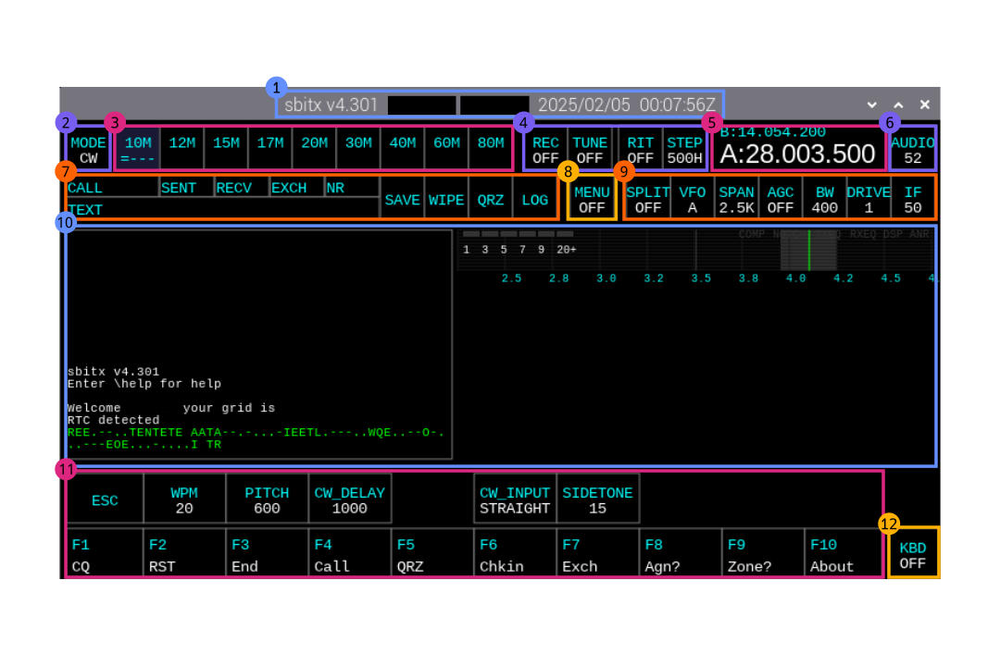
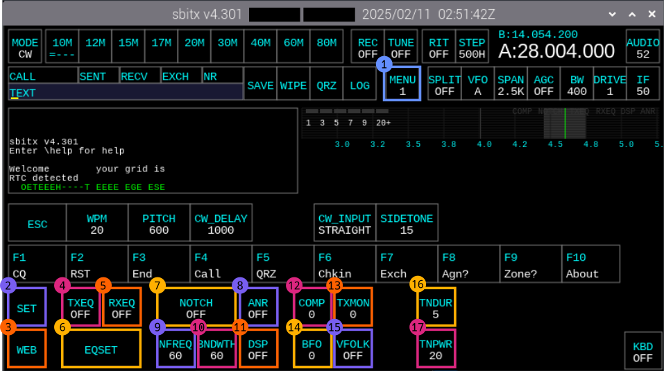
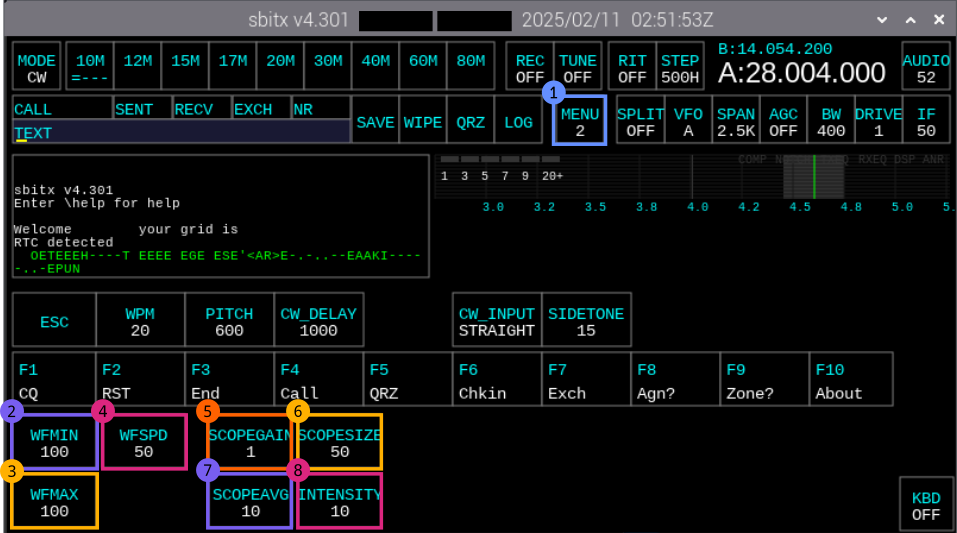
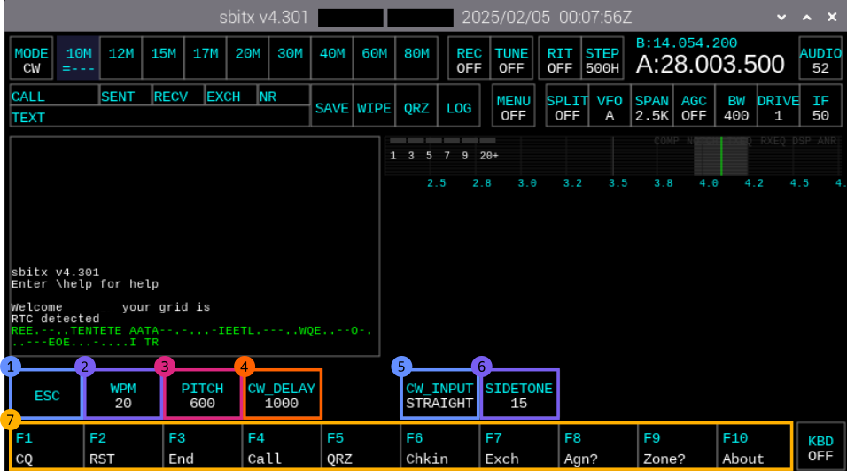
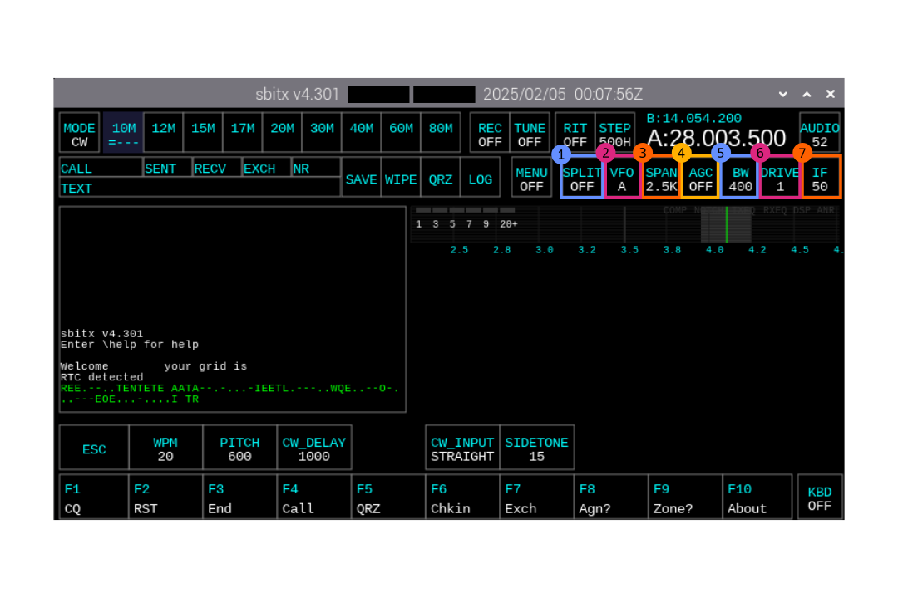
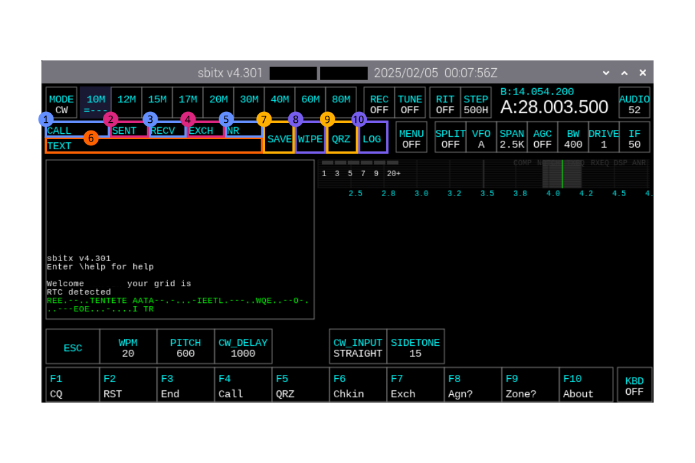
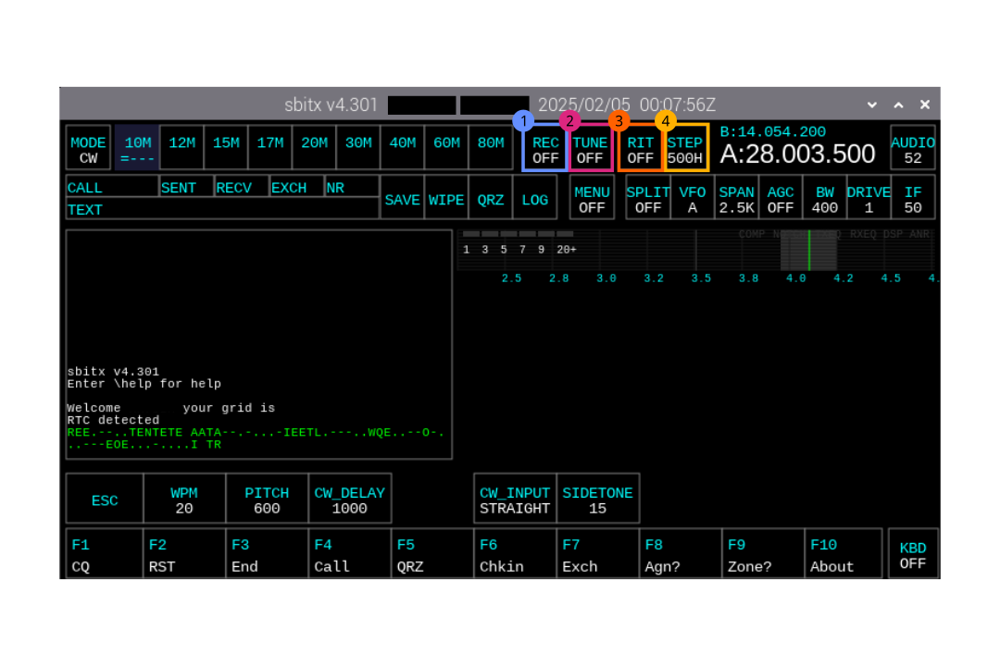

# Controls Guide

This page gathers the control reference images currently used in project wiki resources.

## Main Screen

_Main screen controls overview._

## Menu 1

_First menu controls overview._

## Menu 2

_Second menu controls overview._

## CW Controls

_CW-specific controls and operation._

## Advanced Tuning

_Advanced tuning controls and behavior._

## Logging

_Logging controls and workflow._

## Misc Controls

_Miscellaneous controls reference._
